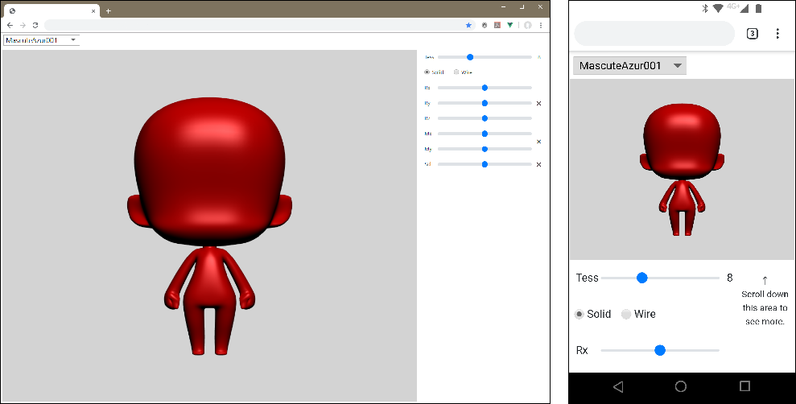
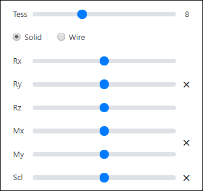
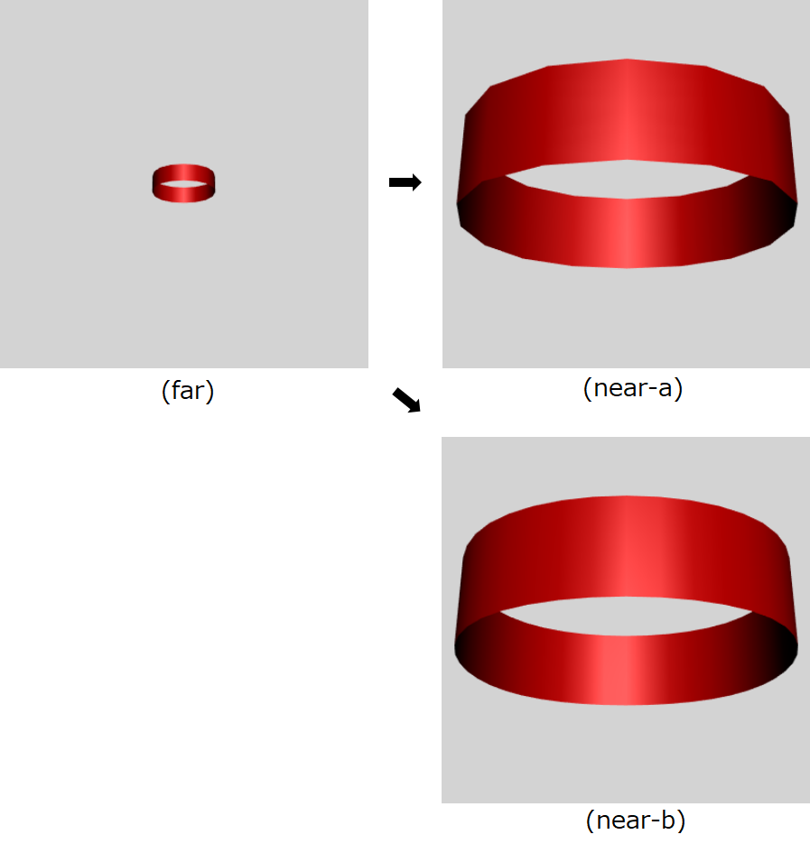

# Beziex_We

This is a 3D model viewer that tessellates unique high-dimensional patches data in real time on WebGL and displays it on a web browser. (Screenshot Left: Windows Chrome, Right: Android Chrome)

Beziex_We は、独自の高次元パッチデータをWebGL上でリアルタイムにテッセレーションし、ウェブブラウザに表示する3Dモデルビューワです。(スクリーンショット 左: Windows Chrome, 右: Android Chrome)

 

ちなみに (スクリーンショット表示の) 元の 3D データとして、「クールなびじゅつかん館長」さんのデータ (CC0 1.0 Universal Public Domain Dedication) を使わせて頂きました。「クールなびじゅつかん館長」さん、ありがとうございます。

<a href="https://twitter.com/thecoolmuseum/status/785896516422471681">クールなびじゅつかん館長さんのツイート : (https://twitter.com/thecoolmuseum/status/785896516422471681)</a>

 

## Description ／ 簡単な説明

Original high-dimensional patches data is:

- Two adjacent patches are connected smoothly. (G1 connection)
- Converted from Catmull–Clark subdivision surface. It's a smooth surface approximating the subdivision shape.
- Corresponding to the creasing shape.
- But, Beziex_We has not converter from subdivision data. The converter has not been released yet. (Intend to release it in open source)

Real-time tessellation algorithm is:

- Use WebGL1 and extensions. Considering an environment that does not support WebGL 2, it is not used.
- WebGL has not tessellation shader. Therefore, Beziex_We uses only vertex and fragment shader.
- To do so, use the `drawElementsInstancedANGLE` function and patch control-points texture.

 

独自の高次元パッチデータについて:

- 隣接する2パッチ間は滑らかにつながります。(G1接続)
- このパッチデータは、Catmull–Clarkサブディビジョンサーフェイスを変換したもので、元のサブディビジョン形状にかなり近似しています。
- Catmull–Clarkサブディビジョンのクリース形状 (折れ曲がった部分) も変換できます。
- ただし Beziex_We にはサブディビジョンからの変換機能はついていません。なおコンバータは既に作成済みですが、まだ公開していません。(オープンソースで公開予定)

リアルタイム テッセレーション アルゴリズムについて:

- WebGL1 と拡張機能を使用。WebGL2 未対応の環境を考慮し、(WebGL2 は) 使っていません。
- WebGL にはテッセレーションシェーダがありません。したがって Beziex_We は、頂点シェーダとフラグメントシェーダだけを使用しています。
- 上記2シェーダだけで対応するために、`drawElementsInstancedANGLE` 関数とパッチ コントロールポイント テクスチャを使っています。

 

## Operating environment ／ 動作環境

Detailed operating environment is unknown. However, operation has been confirmed in the following environment. (Chrome recommended for web browser)

詳細な動作環境は不明です。ただし下記の環境で動作確認しています。(ウェブブラウザは Chrome を推奨)

- i7-6700HQ + GTX 970M + Windows 10 Pro (1903) + Chrome 76 / Firefox 68 / Edge 44
- i5-7300HQ + GTX 1050Ti + Windows 10 Home (1903) + Chrome 76 / Firefox 68
- Snapdragon 625 + Android 8 + Chrome 76
- Snapdragon 630 + Android 9 + Chrome 76

 

なおモバイル環境は、スマートフォンの "縦向き" のみ対応しています。タブレットは、多分コントロールパネルの UI バランスが悪いと思います。(タブレットを持ってないので分からない)

 

## Demo & Usage ／ デモと使い方

You can actually start Beziex_We by opening the link below. Maybe, startup is slow when there is no cache.

下記リンクを開くと、実際に動かしてみることが出来ます。おそらくキャッシュが無い時の起動は遅いです。

<a href="https://beziex.netlify.com/beziex_we/">
Beziex_We :  (https://beziex.netlify.com/beziex_we/)</a>

  

ちなみにデモ環境として、（前述の通り）Netlify を利用させていただきました。

 

さて使い方は、以下の通りとなっています。

リアルタイムにテッセレーションさせることが目的なので、「Tess スライダ」が最も重要です。

 

なおモバイル環境 (縦向き) ではコントロールパネルの一部しか表示されないので、(コントロールパネルを) スクロールして使ってください。

 

<table>
<tr>
<th width="20%">Type/種別</th>
<th width="80%">UI/ユーザーインターフェイス</th>
</tr>
<tr>
<td>Menu</td>
<td></img></td>
</tr>
<tr>
<td>Control panel</td>
<td></img></td>
</tr>
</table>

 

<table>
<tr>
<th width="18%">Title／表示名</th>
<th width="22%">Operation／操作</th>
<th width="60%">Description／説明</th>
</tr>
<tr>
<td>(Menu)</td>
<td>Select data</td>
<td>セレクトボックスのコントロールで、表示データを選択します。</td>
</tr>
<tr>
<td>Tess</td>
<td>Tessellation</td>
<td>パッチの分割数で、常に偶数分割となります。この Tess が Beziex_We の肝です。</td>
</tr>
<tr>
<td>Solid/Wire</td>
<td>Select type</td>
<td>シェーディング面表示、もしくはワイヤーフレーム表示を選択します。</td>
</tr>
<tr>
<td>Rx</td>
<td>Rotate X</td>
<td>X軸周りに回転させます。</td>
</tr>
<tr>
<td>Ry</td>
<td>Rotate Y</td>
<td>Y軸周りに回転させます。</td>
</tr>
<tr>
<td>Rz</td>
<td>Rotate Z</td>
<td>Z軸周りに回転させます。</td>
</tr>
<tr>
<td>&#10006; (rotate)</td>
<td>Rotate initialize</td>
<td>回転マトリックスの初期化。</td>
</tr>
<tr>
<td>Mx</td>
<td>Move X</td>
<td>X方向に平行移動させます。</td>
</tr>
<tr>
<td>My</td>
<td>Move Y</td>
<td>Y方向に平行移動させます。</td>
</tr>
<tr>
<td>&#10006; (move)</td>
<td>Move initialize</td>
<td>平行移動マトリックスの初期化。</td>
</tr>
<tr>
<td>Scl</td>
<td>Scaling</td>
<td>拡大縮小させます。</td>
</tr>
<tr>
<td>&#10006; (scaling)</td>
<td>Scaling initialize</td>
<td>スケーリングマトリックスの初期化。</td>
</tr>
</table>

 

## Why do we need it? ／ なぜ Beziex_We が必要？

まず下図をご覧ください。

 

 

「far」「near-a」「near-b」はリング状の同じパッチデータですが、テッセレーション分割数は以下のようになっています。

<table>
<tr>
<th width="20%">Title／図名</th>
<th width="30%">Perspective／遠近</th>
<th colspan="2">Tessallation／テッセレーション分割数</th>
</tr>
<tr>
<td>far</td>
<td>遠い</td>
<td width="10%">4</td>
<td></td>
</tr>
<tr>
<td>near-a</td>
<td>近い</td>
<td>4</td>
<td>"far" と同じ</td>
</tr>
<tr>
<td>near-b</td>
<td>遠い</td>
<td>10</td>
<td>"far" よりも細かい</td>
</tr>
</table>

 

まず「far」のテッセレーション分割数は 4 ですが、ポリゴンがカクカクしているようには見えません。これはリングが遠くにあり、見た目上小さいからです。

次に、上記リングが遠くから近くに動いてきた場合を考えます。この時もしテッセレーション分割数が 4 のままであれば (近い位置のリングは)「near-a」となりますが、リングが見た目上大きくなるので、ポリゴンがカクカクします。

それに対し、近い位置のリングのテッセレーション分割数を 10 にすると「near-b」のようにカクカクが無くなることが分かるでしょう。これはテッセレーション分割数を増やすと、ポリゴン数が多くなり個々のポリゴンが小さくなるからです。(ワイヤーフレーム表示にして Scl スライダを動かすと、感じが掴めます)

 

ちなみにこの「遠くと近くで異なるポリゴン数にする」技術を、LOD ( Level of Detail ) といいます。そして通常は「ポリゴン数の異なる物体」を複数用意し、遠近の度合いによってそれらを切り替えることで、LOD に対応しています。

しかしこの方法では、複数分の物体を用意することになるのでデータ量が増えるし、また個数を減らすと LOD の切り替え時に「切り替えているのが見えてしまう」ことになります。

 

それに対し Beziex_We では、

- 「ポリゴン数の異なる物体」を複数用意する必要は無い。
- テッセレーション分割数を連続的に増やす (Beziex_We では 2 づつ加算) ことが出来るので、「切り替えているのが見えてしまう」ことも無い。

という利点があるわけです。すなわち LOD に適した技術であると言えます。

 

ちなみに「遠い位置のポリゴン数も多いまま」にすれば、近い位置のポリゴン数と同じに出来るので LOD は必要無いことになります。しかし遠い物体はポリゴン数が少なくてもカクカクしないのに、不必要にポリゴン数を増やすのは、実行速度的にもメモリ使用量的にも良くありません。

そのため LOD は重要な技術であることが分かります。

 

なお実際には Beziex_We に、「遠近により自動的にテッセレーション分割数を変化させる」機能は付いていません。しかし「テッセレーション分割数を変化させる」機能はあるので、それを Z 値と結びつけるのは難しくないはずと考えます。(計算方法はいくつか考えられますが)

 

## Install environment for build / ビルド環境のインストール

ここでは Windows 上でのビルド方法について記します。なお Windows 10 でしか検証していません。

 

### Beziex_We の取得

既にこの README.md を、下記 URL の github 上でご覧になっていると思います。まずは一式を Clone もしくはダウンロードしてください。

<a href="https://github.com/beziex/Beziex_We">beziex/Beziex_We [github] :  (https://github.com/beziex/Beziex_We)</a>

以後、"C:\dev\\" 直下に Beziex_We というフォルダ名で、ファイル一式があるものとして説明します。(PATH は、"C:\dev\Beziex_We\\" となります)

 

### Node.js のインストール

Beziex_We では、各種 node module を使用します。これらをインストールするためには、Node.js が必要です。

<a href="https://nodejs.org/ja/">Node.js :  (https://nodejs.org/ja/)</a>

 

### Visual Studio Code のインストール

特に Visual Studio Code を使わなくてもビルド出来ると思いますが、以後ここでは使用した場合について記します。下記サイトからダウンロードし、インストールしてください。

<a href="https://code.visualstudio.com/">Visual Studio Code :  (https://code.visualstudio.com/)</a>

 

###  Chrome のインストール

インストールされてないということは無いと思いますが、もし Chrome が入ってない場合はインストールしてください。Beziex_We でデバッグ起動すると、Chrome が立ち上がるように設定してあります。

<a href="https://www.google.com/intl/ja_jp/chrome/">Chrome :  (https://www.google.com/intl/ja_jp/chrome/)</a>

 

## Building ／ビルド手順

Beziex_We の開発言語は TypeScript です。TypeScript はウェブブラウザで直接動かないので、JavaScript に変換 (トランスパイル) するビルド作業が必要です。

 

### Visual Studio Code を起動する

Visual Studio Code を起動します。以後、Visual Studio Code 上での作業となります。

 

### "フォルダーを開く" を実行

「ファイル」→「フォルダーを開く」を実行してください。その後、

- Clone もしくはダウンロードした先の、ローカルフォルダ

を選択します。例の場合では、"C:\dev\\" 直下の Beziex_We フォルダ (つまり PATH は、"C:\dev\Beziex_We\\" ) となります。

 

### "npm install" を実行

まず「ターミナル」→「タスクの実行...」を選択します。そして "npm install" を選んで、実行してください。

これにより前述の各種 node module がインストールされます。

 

### "ビルド タスクの実行..." を実行

「ターミナル」→「ビルド タスクの実行...」を選択すると、ビルドを実行します。

 

### "デバッグの開始" を実行

「デバッグ」→「デバッグの開始」を実行すると専用の Chrome が立ち上がり、その中で Beziex_We が起動します。

ちなみにローカルファイルとして起動されますが、Beziex_We は複数ファイルから成り立っているので、(デバッグ時は) ローカルファイルからローカルファイルを読み込むことになります。しかし Chrome は通常、セキュリティの観点からこの操作を禁止しています。そこで launch.json 内に "--allow-file-access-from-files" という Chrome の起動オプションを書くことで対処しました。

 

## License ／ ライセンス

<a href="https://opensource.org/licenses/MIT">MIT</a>

Copyright (c) 2019 beziex

 

## Dependency library ／ 使用ライブラリ

以下に、主だった使用ライブラリ (使用技術) を記述しました。

 

<table>
<tr>
<th width="15%">Name／名称</th>
<th width="15%">License／ライセンス</th>
<th width="70%">Description／説明</th>
</tr>
<tr>
<td>TypeScript</td>
<td>Apache License 2.0</td>
<td>プログラミング言語。 
<a href="https://www.typescriptlang.org">https://www.typescriptlang.org</a></td>
</tr>
<tr>
<td>Vue.js</td>
<td>MIT</td>
<td>JavaScript フレームワーク。 
<a href="https://jp.vuejs.org/index.html">https://jp.vuejs.org/index.html</a></td>
</tr>
<tr>
<td>webpack</td>
<td>MIT</td>
<td>JavaScript モジュールバンドラ。 
<a href="https://webpack.js.org/">https://webpack.js.org/</a></td>
</tr>
<tr>
<td>glMatrix</td>
<td>MIT</td>
<td>JavaScript 用マトリックス演算ライブラリ。 
<a href="http://glmatrix.net/">http://glmatrix.net/</a></td>
</tr>
<tr>
<td>BootstrapVue</td>
<td>MIT</td>
<td>Vue.js 用 UI ライブラリ。 
<a href="https://bootstrap-vue.js.org/">https://bootstrap-vue.js.org/</a></td>
</tr>
<tr>
<td>nodeca/pako</td>
<td>MIT</td>
<td>JavaScript 用 GZIP ライブラリ。 
<a href="https://github.com/nodeca/pako">https://github.com/nodeca/pako</a></td>
</tr>
<tr>
<td>kaimallea/isMobile</td>
<td>MIT</td>
<td>ブラウザがデスクトップ版 or モバイル版のどちらであるかを判定する。 
<a href="https://github.com/kaimallea/isMobile">https://github.com/kaimallea/isMobile</a></td>
</tr>
</table>

 

## Included 3D Data ／ 内包 3D データ

Beziex_We のセレクトボックスから選択可能な 3D データ (実体は Beziex_We/data フォルダ内にある) について、以下に記します。

 

<table>
<tr>
<th width="15%">Name／名称</th>
<th width="15%">License／ライセンス</th>
<th width="70%">Description／説明</th>
</tr>
<tr>
<td>MascuteAzur001.gzjson MascutePav001.gzjson</td>
<td>CC0 1.0</td>
<td><a href="https://twitter.com/thecoolmuseum/status/785896516422471681">
https://twitter.com/thecoolmuseum/status/785896516422471681</a></td>
</tr>
<tr>
<td>04_Cup1.gzjson 18_Ring0.gzjson 19_Sphere1.gzjson </td>
<td>CC0 1.0</td>
<td>beziex オリジナルの簡単な形状</td>
</tr>
<tr>
<td>Hippopotamus.gzjson</td>
<td>CC-BY 3.0</td>
<td>Poly by Google <a href="https://poly.google.com/view/4HNi8dZMdZa">
https://poly.google.com/view/4HNi8dZMdZa</a></td>
</tr>
<tr>
<td>Manatee (Manatee_01.gzjson)</td>
<td>CC-BY 3.0</td>
<td>Poly by Google <a href="https://poly.google.com/view/eOwLJiwAPJe">
https://poly.google.com/view/eOwLJiwAPJe</a></td>
</tr>
</table>
CC0 1.0 : パブリックドメイン

CC-BY 3.0 : 一般公開／リミックス可

 

これらの 3D データは、JSON を GZIP したものとなっています。
ちなみに拡張子を .gz では無く .gzjson とした理由は、Firefox 上にて https で「拡張子が .gz のファイル」を読み込むと、不正なデータとなるからです。.gz としなければ、なぜか大丈夫でした。

（参考）<a href="https://stackoverflow.com/questions/30292868/firefox-fails-to-decompress-gzip-files">stackoverflow : Firefox fails to decompress gzip files</a>

 

## More info ／ さらなる情報

<a href="https://qiita.com/beziex/items/d3ad67752dba8cc355c7">Qiita：WebGL でテッセレーションして、曲面パッチ間が滑らかに繋がった物体を表示（１）</a>

<a href="https://qiita.com/beziex/items/d913102ca03266996a0e">Qiita：WebGL でテッセレーションして、曲面パッチ間が滑らかに繋がった物体を表示（２）</a>

<a href="https://qiita.com/beziex/items/00b614f7aa73f5124a19">Qiita：WebGL でテッセレーションして、曲面パッチ間が滑らかに繋がった物体を表示（番外編：法線について）</a>

 

